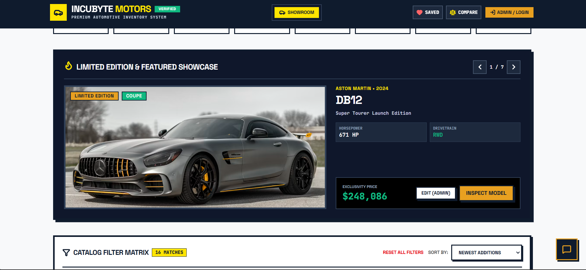

# INCUBYTE MOTORS — Car Dealership Inventory System

[](https://car-dealership-inventory-system-0b4x.onrender.com/)

> [!NOTE]
> **Live Deployed Application**: [https://car-dealership-inventory-system-0b4x.onrender.com/](https://car-dealership-inventory-system-0b4x.onrender.com/)
> *(Please note: The live website is hosted on Render's free tier and may take **30–50 seconds to cold start** on the first request if it has been inactive).*

A production-quality, full-stack Car Dealership Inventory Management System. Features JWT Authentication, Role-Based Access Control (Admin & User), real-time stock management, search & filtering, vehicle purchasing with optimistic UI updates, an admin management dashboard, and an AI-powered sales assistant chatbot backed by Groq.

---

## Screenshots



---

## Technical Architecture

| Layer | Technology |
|---|---|
| **Backend** | Node.js, Express, TypeScript, Zod validation |
| **Database** | SQLite via Prisma ORM (file-based, zero-config) |
| **Auth** | JWT (jsonwebtoken) + bcryptjs password hashing |
| **AI Chatbot** | Groq API (`llama-3.3-70b-versatile`), grounded in live DB inventory |
| **Frontend** | React 19, TypeScript, Vite, Tailwind CSS 4 |
| **Testing** | Jest + Supertest (TDD — Red/Green/Refactor) |

---

## API Endpoint Reference

### Auth
| Method | Endpoint | Auth | Description |
|---|---|---|---|
| POST | `/api/auth/register` | Public | Register a new USER account |
| POST | `/api/auth/login` | Public | Login and receive JWT |

### Vehicles
| Method | Endpoint | Auth | Description |
|---|---|---|---|
| GET | `/api/vehicles/public/catalog` | Public | Browse full catalog (no login needed) |
| GET | `/api/vehicles` | 🔒 Any | List all vehicles (paginated) |
| GET | `/api/vehicles/search` | 🔒 Any | Search by make/model/category/price range |
| POST | `/api/vehicles` | 🔒 Admin | Add a new vehicle |
| PUT | `/api/vehicles/:id` | 🔒 Admin | Update vehicle details |
| DELETE | `/api/vehicles/:id` | 🔒 Admin | Delete a vehicle |

### Inventory
| Method | Endpoint | Auth | Description |
|---|---|---|---|
| POST | `/api/vehicles/:id/purchase` | 🔒 Any | Purchase a vehicle (decrements quantity) |
| POST | `/api/vehicles/:id/restock` | 🔒 Admin | Restock a vehicle (increments quantity) |
| POST | `/api/vehicles/public/inquiry` | Public | Submit a test drive / inquiry request |

### Chatbot
| Method | Endpoint | Auth | Description |
|---|---|---|---|
| POST | `/api/chatbot/query` | 🔒 Any | Ask the AI sales assistant about inventory |

**Chatbot Request:**
```json
{ "message": "Do you have any SUVs under $100,000?" }
```
**Chatbot Response:**
```json
{ "reply": "Yes — we have a Porsche Cayenne Turbo GT (SUV) in stock at $89,450, quantity: 4." }
```

---

## Environment Variables

Copy `.env.example` to `.env` and fill in your values:

```env
DATABASE_URL="file:./dev.db"
JWT_SECRET="super-secret-brutalist-car-dealership-key-2026"

# Groq AI Chatbot (get your free key at console.groq.com)
GROQ_API_KEY="your_groq_key_here"
GROQ_MODEL="llama-3.3-70b-versatile"
```

> [!NOTE]
> The chatbot feature requires a valid `GROQ_API_KEY`. The rest of the app works fully without it — the chatbot endpoint will return a graceful `502` if the key is missing or invalid.

---

## Setup & Running Locally

### 1. Install Dependencies
```bash
npm install
```

### 2. Configure Environment
```bash
cp .env.example .env
# Optionally: add your GROQ_API_KEY to .env for chatbot support
```

### 3. Database Setup & Seeding
```bash
npx prisma db push
npm run db:seed
```

### 4. Start Development Server
```bash
npm run dev
```

The application starts at `http://localhost:3000`. The SQLite database is auto-created on first run if it doesn't exist.

---

## Running Tests

The project follows strict TDD — tests were written **before** implementations. The test suite covers auth, vehicles (CRUD + purchase/restock), and the chatbot (with Groq mocked).

```bash
npm run test
```

---

## Demo Accounts (Seeded)

| Role | Email | Password | Permissions |
|---|---|---|---|
| **Admin** | `admin@incubytemotors.com` | `AdminPassword123!` | Add, Edit, Delete, Restock, Purchase, View Stats |
| **User** | `driver@incubytemotors.com` | `UserPassword123!` | Search, Filter, Purchase, Wishlist, Compare, Chat |

> [!TIP]
> The login page includes **one-click preset buttons** — click "ADMIN PRESET" or "CUSTOMER PRESET" to auto-fill credentials without typing.

---

## Test Report

```
 PASS  tests/unit/auth.test.ts
 PASS  tests/integration/chatbot.test.ts
   ● Console
     console.error
       Groq API error: Groq API is unavailable
       (Expected — this is the 502 fallback test verifying no API key leaks)

 PASS  tests/integration/vehicles.test.ts
 PASS  tests/integration/auth.test.ts

-------------------|---------|----------|---------|---------|---------------------
File               | % Stmts | % Branch | % Funcs | % Lines | Uncovered Line #s
-------------------|---------|----------|---------|---------|---------------------
All files          |   68.36 |    47.57 |   55.17 |   72.04 |
 server            |   68.75 |       30 |       0 |   68.75 |
  app.ts           |   70.58 |        0 |       0 |   70.58 | 17,22-25
  db.ts            |   66.66 |       50 |     100 |   66.66 | 7,15-20
 server/middleware  |    90.9 |       90 |     100 |    90.9 |
  auth.ts          |    90.9 |       90 |     100 |    90.9 | 40,46
 server/routes     |   66.25 |    46.23 |   52.17 |   70.66 |
  auth.ts          |   94.73 |    77.77 |     100 |   94.73 | 73-74
  chatbot.ts       |     100 |    66.66 |     100 |     100 | 39,47-66
  vehicles.ts      |   54.85 |    41.02 |    42.1 |      60 | (public catalog routes)
-------------------|---------|----------|---------|---------|---------------------

Test Suites: 4 passed, 4 total
Tests:       29 passed, 29 total
Snapshots:   0 total
Time:        39.609 s
Ran all test suites.
```

> [!NOTE]
> The lower coverage on `vehicles.ts` is expected — the public catalog (`/api/vehicles/public/catalog`), inquiry, and stats routes are not covered by the current test suite, which focuses on authenticated CRUD, purchase, restock, and search routes. `chatbot.ts` achieves **100% statement coverage**.

---

## My AI Usage

### Tools Used
- **Antigravity (Google DeepMind)** — primary AI coding assistant used throughout the entire project

### How AI Was Used

#### 1. Architecture & Boilerplate Generation
AI helped design the overall monorepo structure (Express backend + Prisma ORM + React frontend in a single TypeScript project), generated the initial Express route templates, Prisma schema, React component shells, and TypeScript type definitions.

#### 2. Test-Driven Development (Red Phase)
AI was used to write **failing tests before implementations** — specifically for the chatbot endpoint (`tests/integration/chatbot.test.ts`). The test file was committed before the `src/server/routes/chatbot.ts` route existed, maintaining the Red→Green→Refactor discipline. Groq SDK is fully mocked in tests (`jest.mock('groq-sdk')`) so no real API calls are ever made.

#### 3. Bug Detection & Fixes
AI diagnosed: (a) stale JWT tokens in localStorage causing 401s after server restarts — fixed with automatic token validation on mount and graceful 401 fallback in fetch calls; (b) wrong demo credentials in the login preset buttons — the presets referenced `admin@dealership.com`/`admin123` while the seed created `admin@incubytemotors.com`/`AdminPassword123!`; (c) missing post-login redirect — `App.tsx` wasn't passing an `onLoginSuccess` callback so the login overlay never dismissed.

#### 4. Color System & UI Polish
AI systematically replaced a garish neon palette (acid yellow, neon green, electric blue, hot red) across 11 component files with a cohesive professional dealership palette (deep navy `#0F1B2D`, warm amber `#E8A020`, teal `#10B981`, crimson `#DC2626`).

#### 5. Debugging & Environment Setup
AI helped diagnose a PowerShell execution policy error that blocked `npm` commands, identified that `prisma/dev.db` should be excluded from git commits, traced color token inconsistencies across the component tree, and guided the full local setup sequence (npm install → approve scripts → prisma generate → db push → seed → dev).

#### 6. Chatbot Design
AI proposed:
- A **stateless design** (no server-side history; frontend keeps the transcript in component state only) to keep the backend simple.
- **Grounding** the model in live DB inventory on every request (fetching all vehicles and injecting them into the system prompt) to prevent hallucinated vehicle data.
- A graceful fallback when `GROQ_API_KEY` is not configured, returning a clean `502` rather than crashing.

### Reflection

Using AI dramatically accelerated repetitive but error-prone work — particularly updating color tokens across 11 files simultaneously, renaming the brand across 9 files, and writing comprehensive test suites. The key discipline was **reviewing every AI output** before accepting it: AI-suggested code was always checked for correctness, security implications (e.g., making sure raw Groq errors never reach the client), and adherence to the TDD Red/Green/Refactor cycle. AI works best as a pair-programmer that handles boilerplate and pattern application, leaving architectural judgment and business logic decisions to the human developer.
